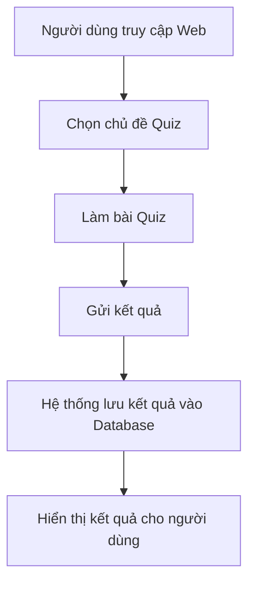

# Web-Quizizz 🎯

## 👥  Nhóm thực hiện **nhóm 10**  
---  

**Thành viên**  
- BÙI VĂN ĐẠI-23010366
---  

## Dự án Wed-Quiz  
---  
## 📌 Giới thiệu các tính năng của dự án  
**Chức năng** web-Quiz là giúp chúng ta học tập 1 cách hiệu quả về trắc nghiệm, giúp ghi nhớ lâu và tiện lợi   
**Tính năng**  
- Đăng ký / đăng nhập
- Làm quiz trực tuyến
- xem lại kết quả đã làm 
- Xem điểm số

---  
## 💻 Công nghệ sử dụng  
- HTML
- CSS
- SCSS
- JAVASCRIPT
- REACT.JS
---   
## 🧠 Lưu đồ thuật toán

---
## UML 

---  
## Giao diện trang chủ  

  

